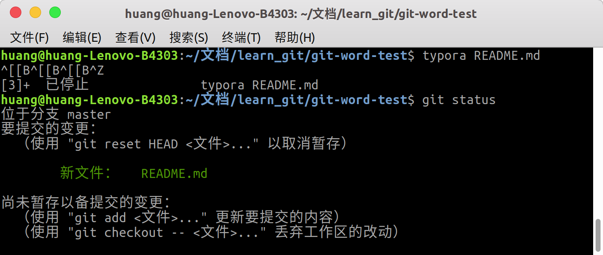
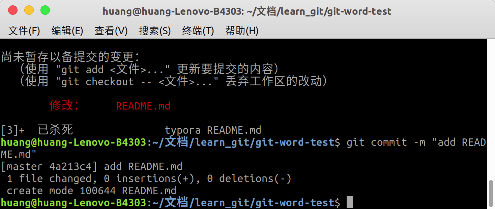
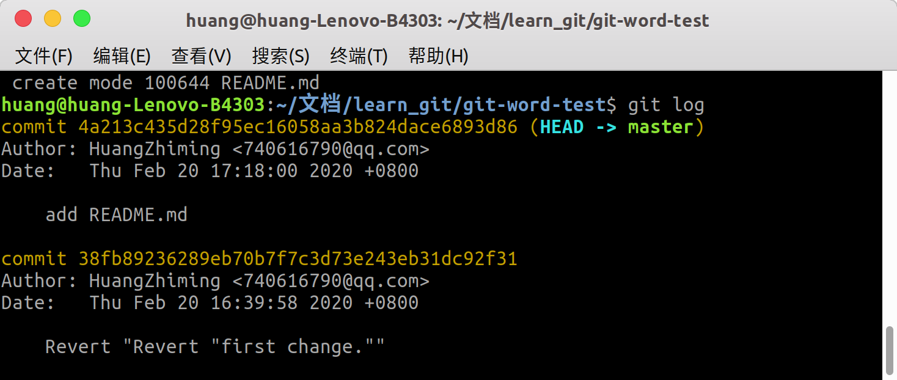

# 使用git命令的总体感受

- 其实没有那么难

  >  基本上掌握几个命令就可以进行版本控制了。

- 基本的使用容易上手，但是有各种命令，一时难以变成专家

# git使用回顾

1. 创建一个git目录

   ```bash
   cd git-word-test # 我们要创建的目录
   git init # 初始化，建立了.git文件夹
   ```
   
2. 新建一个文件并编辑

   ```bash
   # 在我们创建的目录下新建一个文档
   touch README.md # 比如说本文档 README.md
   git add README.md # 将新建的文件加入到git的控制中去。
   # 使用相对应的编辑器进行编辑 typora 编辑本文档，然后保存。
   ```

3. 查看git目录的状态，看我们有什么需要提交的

   ```bash
   git status # 查看我们的目录下有什么变动
   ```
	
	
4. 提交我们的更改

   ```bash
    git commit -m "add README.md" # 提交更改并注明更改的主题或者概要
   ```
	 
	
5. 查看我们的commit

   ```bash
   git log # 查看修改记录
   ```
	
   
6. 结束。

